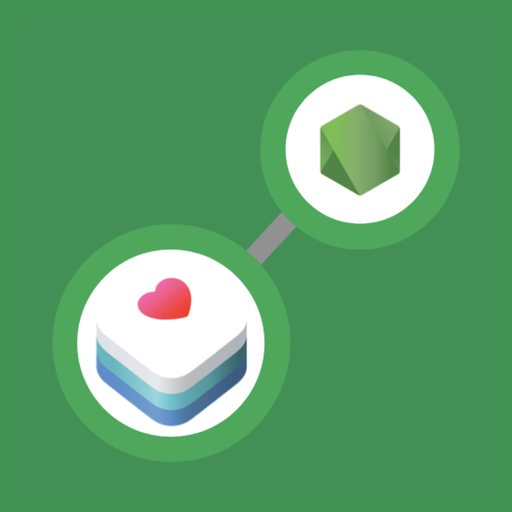

<div id="top"></div>

<br />
<div align="center">
  <a href="https://github.com/codebymini/healthnode">
    
  </a>

<h3 align="center">HealthNode</h3>

  <p align="center">
    Living with diabetes type 1 is a great hazzle trying to find balance between carbs and
    insulin. Since there are multiple factors besides the two mentioned above, this project
    aims at visualising the correlation between physical activity and glucose levels in the blood.
    <br />
    <br />
    <a href="https://github.com/codebymini/healthnode"><strong>Explore the docs »</strong></a>
    <br />
    ·
    <a href="https://github.com/codebymini/healthnode/issues">Report Bug</a>
    ·
    <a href="https://github.com/codebymini/healthnode/issues">Request Feature</a>
  </p>
</div>


<!-- TABLE OF CONTENTS -->
<details>
  <summary>Table of Contents</summary>
  <ol>
    <li>
      <a href="#about-the-project">About The Project</a>
      <ul>
        <li><a href="#built-with">Built With</a></li>
      </ul>
    </li>
    <li>
      <a href="#getting-started">Getting Started</a>
      <ul>
        <li><a href="#prerequisites">Prerequisites</a></li>
        <li><a href="#installation">Installation</a></li>
      </ul>
    </li>
    <li><a href="#usage">Usage</a></li>
    <li><a href="#roadmap">Roadmap</a></li>
    <li><a href="#contributing">Contributing</a></li>
    <li><a href="#license">License</a></li>
    <li><a href="#contact">Contact</a></li>
    <li><a href="#acknowledgments">Acknowledgments</a></li>
  </ol>
</details>
<br />


<!-- ABOUT THE PROJECT -->
## About The Project

This is a multipart project containing an iPhone app, Back- and Front-end in Node.js and Kubernetes deployment definitions. It also utilize a Atlas MongoDB.

<p align="right">(<a href="#top">back to top</a>)</p>


### Built With
* [MicroK8s](https://microk8s.io/)
* [Atlas MongoDB](https://www.mongodb.com/atlas/)
* [React.js](https://reactjs.org/)
* [Xcode](https://developer.apple.com/xcode/)


<p align="right">(<a href="#top">back to top</a>)</p>


<!-- GETTING STARTED -->
## Getting Started

The following instructions is for setting this project up locally. However, The main project is built on <a href="https://www.linode.com/">Linode</a> utilizing a Linode 2 GB with Ubuntu 21.10 installed.
<br />
<br />

### Prerequisites
A linux machine, virtual, physical or cloudbased.
MicroK8s runs in as little as 540MB but more RAM is recommended


### Installation
Updates the package lists

```sudo apt-get update```

Install microk8s with snap

```sudo snap install microk8s --classic```

Add user to group

```sudo usermod -a -G microk8s $USER```

Set access to .-kube

```sudo chown -f -R $USER ~/.kube```

Re-enter session

```su - $USER```

Set the alias for kubectl

```alias kubectl='microk8s kubectl'```

Clone the repo containing the kubernetes deployment files

```git clone https://github.com/CodeByMini/HealthNode```

Go to the folder

```cd HealthNode```

Deploy the files with:

```kubectl apply -f 1-namespace.yaml```
```kubectl apply -f 3-healthnodeapi.yaml```
```kubectl apply -f 4-healthnode.yaml```


<p align="right">(<a href="#top">back to top</a>)</p>


<!-- USAGE EXAMPLES -->
## Usage


<p align="right">(<a href="#top">back to top</a>)</p>


<!-- ROADMAP -->
## Roadmap

- [] Feature 1
- [] Feature 2
- [] Feature 3
    - [] Nested Feature

See the [open issues](https://github.com/codebymini/healthnode/issues) for a full list of proposed features (and known issues).

<p align="right">(<a href="#top">back to top</a>)</p>


<!-- CONTRIBUTING -->
## Contributing

Contributions are what make the open source community such an amazing place to learn, inspire, and create. Any contributions you make are **greatly appreciated**.

If you have a suggestion that would make this better, please fork the repo and create a pull request. You can also simply open an issue with the tag "enhancement".
Don't forget to give the project a star! Thanks again!

1. Fork the Project
2. Create your Feature Branch (`git checkout -b feature/AmazingFeature`)
3. Commit your Changes (`git commit -m 'Add some AmazingFeature'`)
4. Push to the Branch (`git push origin feature/AmazingFeature`)
5. Open a Pull Request

<p align="right">(<a href="#top">back to top</a>)</p>


<!-- LICENSE -->
## License

Distributed under the MIT License. See `LICENSE.txt` for more information.

<p align="right">(<a href="#top">back to top</a>)</p>


<!-- CONTACT -->
## Contact

Daniel Mini Johansson - daniel@codebymini.se

[![LinkedIn][linkedin-shield]][linkedin-url]

Project Link: [https://github.com/codebymini/healthnode](https://github.com/codebymini/healthnode)

<p align="right">(<a href="#top">back to top</a>)</p>


<!-- ACKNOWLEDGMENTS 
## Acknowledgments

* []()
* []()
* []()

<p align="right">(<a href="#top">back to top</a>)</p>
-->


<!-- MARKDOWN LINKS & IMAGES -->
<!-- https://www.markdownguide.org/basic-syntax/#reference-style-links -->
[contributors-shield]: https://img.shields.io/github/contributors/codebymini/healthnode.svg?style=for-the-badge
[contributors-url]: https://github.com/codebymini/healthnode/graphs/contributors
[forks-shield]: https://img.shields.io/github/forks/codebymini/healthnode.svg?style=for-the-badge
[forks-url]: https://github.com/codebymini/healthnode/network/members
[stars-shield]: https://img.shields.io/github/stars/codebymini/healthnode.svg?style=for-the-badge
[stars-url]: https://github.com/codebymini/healthnode/stargazers
[issues-shield]: https://img.shields.io/github/issues/codebymini/healthnode.svg?style=for-the-badge
[issues-url]: https://github.com/codebymini/healthnode/issues
[license-shield]: https://img.shields.io/github/license/codebymini/healthnode.svg?style=for-the-badge
[license-url]: https://github.com/codebymini/healthnode/blob/master/LICENSE.txt
[linkedin-shield]: https://img.shields.io/badge/-LinkedIn-black.svg?style=for-the-badge&logo=linkedin&colorB=555
[linkedin-url]: https://linkedin.com/in/https://www.linkedin.com/in/daniel-johansson-4b099219a/
[product-screenshot]: images/screenshot.png